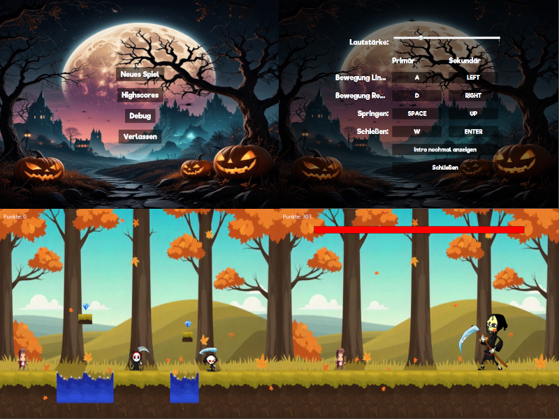

# <p align="center">Projektwoche vom 10.03.-14.03.25</p>

# <p align="center">🎃 Eumels Höllish Süßes Abenteuer</p>
Ein Halloween-Jump-'n'-Run mit Bonbons, Skeletten und jeder Menge Spaß!

## <p align="center">🕹️ Über das Spiel</p>
In diesem 2D-Jump-'n'-Run begleitest du Eumel, unseren mutigen Helden, der sich mit magischen Bonbons gegen eine Armee von fiesen Skeletten verteidigt. Einige Gegner feuern sogar brennende Jack-O’-Lanterns – also sei vorsichtig! Schlage dich durch verschiedene Level voller Halloween-Atmosphäre und besiege die untoten Plagegeister!

## <p align="center">🎯 Features</p>
- ✅ Jump-'n'-Run-Action: Laufe, springe und weiche Angriffen aus!
- ✅ Magische Bonbon-Waffe: Verteidige dich mit süßer Munition!
- ✅ Schatztruhen
- ✅ Skelett-Gegner: Verschiedene Arten, einige mit Spezialangriffen!
- ✅ Bosskampf: Stelle dich mächtigen Gegnern am Ende eines Levels!
- ✅ Halloween-Setting: Düstere Wälder, gruselige Hintergründe!
- ✅ Power-Ups & neue Bonbon-Typen
- ✅ stimmungsvolle Musik
- ✅ die Möglichkeit sich wiederzubeleben, indem man eine einfache Frage beantwortet 😊
- ✅ Highscoreliste

## <p align="center">🚀 Installation & Start</p>
Voraussetzungen
- Java 17+ muss installiert sein [(Download hier)](https://adoptium.net/)
- Falls du Maven nutzt, stelle sicher, dass es installiert ist [(Download hier)](https://maven.apache.org/download.cgi)
# Projekt ausführen
1. Repository klonen:
```
bash

git clone https://github.com/deinusername/eumels-halloween-abenteuer.git
cd eumels-halloween-abenteuer
```
2. Mit Maven bauen & starten:
```
bash

mvn clean package
java -jar target/eumels-halloween-abenteuer.jar
```
# In einer IDE starten
Falls du IntelliJ IDEA oder Eclipse nutzt:

1. Das Projekt in der IDE öffnen
2. Projekt SDK jetBrains 21.0.6
3. als Java Application ausführen (Main-Klasse auswählen)

## <p align="center">🎮 Steuerung</p>
- Standardtasten
- freie Auswahl der Tasten in den Einstellungen
- Lautstärkesteuerung in den Einstellungen

## <p align="center">🖼️ Screenshots</p>


## <p align="center">🏆 To-Do (Geplante Features)</p>
 - ❌ Spiel speichern und laden
 - ❌ Mehr Soundeffekte
 - ❌ Mehr Level & Gegner
 - ❌ jedes Level einen Boss einfügen
 - ❌ MiniBosse integrieren
 - ❌ Spezialfähigkeiten für Eumel
 - ❌ Held und Gegner besser animieren
 - ❌ mehr Fragen Integrieren zum Wiederbeleben

## <p align="center">🚨 FixMe – Noch in Arbeit! 🛠️</p>
#### <p align="center">nach Abgabe am 14.03.</p>
 - 🔧 Framerate verbessern
 
# <p align="center">😊 Entwickler</p>
- 👤 Ulf Treichel
- 📧 Kontakt: info@skill-net.pro
- 📌 GitHub: github.com/ulftreichel

📜 Lizenz
Dieses Projekt steht unter der MIT-Lizenz – du kannst es frei verwenden, ändern und verbreiten.
